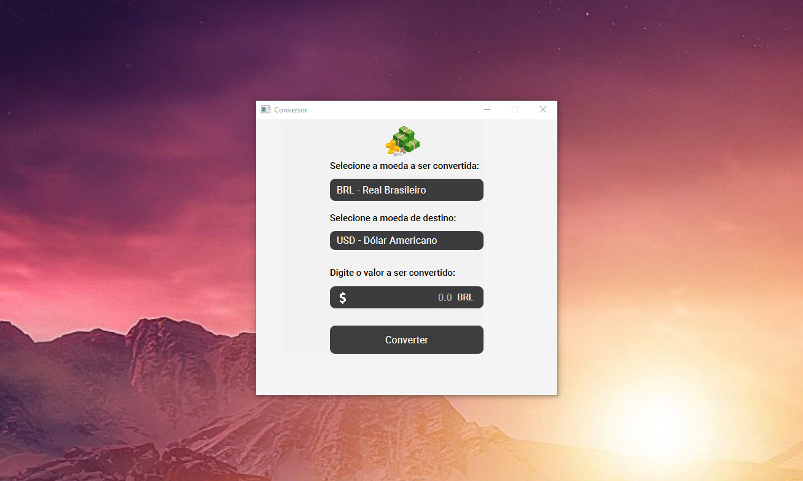

<h1 align="center">Challenge ONE Backend - Conversor</h1>

    <apan align="center">
      
    

## 💻 Projeto

 Nesta oportunidade foi solicitado para nós Devs a criação de um conversor de moeda utilizando a linguagem Java. As características solicitadas por nosso cliente são as seguintes:

O conversor de moeda deverá:

     - Converter de Reais a Dólar
     - Converter de Reais a Euro
     - Converter de Reais a Libras Esterlinas
     - Converter de Reais a Peso argentino
     - Converter de Reais a Peso Chileno

Lembrando que deve ser possível também converter de forma inversa ou seja:

       - Converter de Dólar a Reais
       - Converter de Euro a Reais
       - Converter de Libras Esterlinas a Reais
       - Converter de Peso argentino a  Reais
       - Converter de Peso Chileno a Reais

## 🧪 Tecnologias utilizadas

<ul>
     <li>Java 11</li>
     <li>JavaFX</li>
     <li>Maven</li>
     <li>SceneBuilder</li>
     <li>API: <a href="https://docs.awesomeapi.com.br/api-de-moedas">https://docs.awesomeapi.com.br/api-de-moedas</a></li>
</ul>
